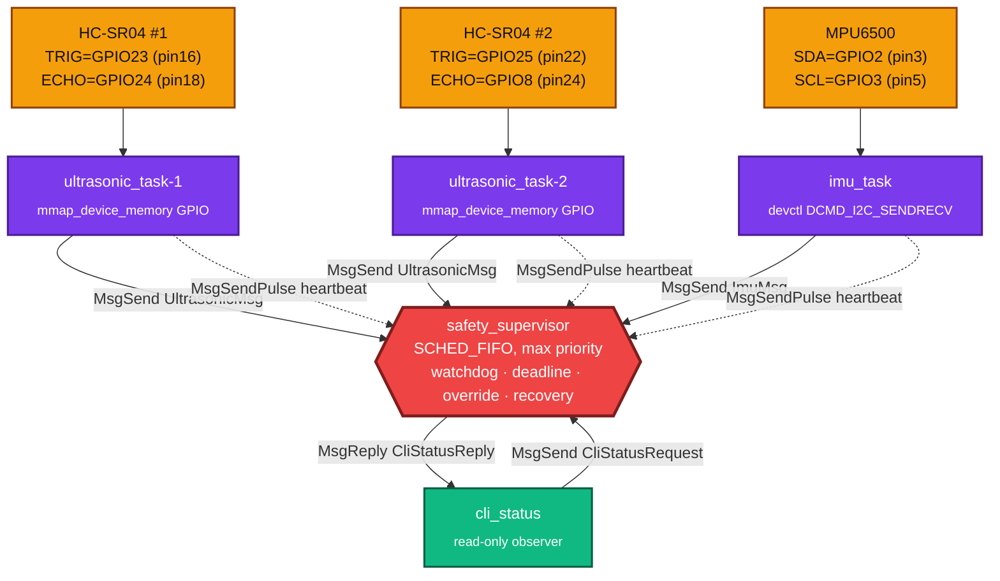
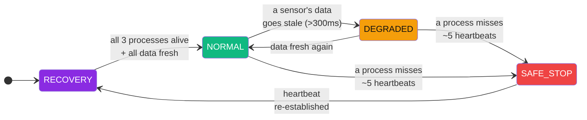

<div align="center">


<br/>


</div>

<br/>

## What this actually is

A **safety supervisor for autonomous vehicles**, built as five independent QNX processes instead of one program with five functions. That's not a style choice — it's the entire point. On a monolithic OS, "isolating the safety logic from the sensor drivers" is a discipline you hope your team maintains. On QNX, it's **structural**: `imu_task` can segfault on a bad I²C read and `supervisor` will never know, because they don't share an address space. This repo is built to prove that difference, not just claim it.

<div align="center">

| | | |
|:---:|:---:|:---:|
| 🟣 **5 processes** | 🟠 **2× ultrasonic + 1× IMU** | 🔴 **1 supervisor at max RT priority** |
| Own address space each | Fused into one override decision | Watchdog + deadline + recovery for all three |

</div>

---

## 🏗️ Architecture



Solid arrows are **synchronous `MsgSend`/`MsgReply`** (sensor data, CLI queries). Dashed arrows are **async `MsgSendPulse`** heartbeats — cheap, non-blocking, and never delayed by a slow sample cycle because each runs on its own thread. Every arrow into `supervisor` terminates at the *same* channel; `name_attach()`/`name_open()` let all four clients find it by name, with zero hardcoded pids.

### Safety state machine



---

## ✅ Requirement → implementation

| Requirement | Where it lives | How |
|---|---|---|
| 🔀 **Message Passing** | all 5 processes | Native `MsgSend`/`MsgReceive`/`MsgReply` over a `name_attach()`-registered channel — no sockets, no queues |
| 💓 **Heartbeat** | every sensor task | Dedicated thread, `MsgSendPulse` every 50ms, independent of the sampling loop |
| 🐕 **Watchdog** | `supervisor.cpp::checkWatchdog` | ~5 missed heartbeats → process declared dead, logged, state transitions |
| ⏱️ **Safety Deadline** | `supervisor.cpp::checkDeadline` | Data older than 300ms is untrusted even if the process is alive — a *different* failure mode than a dead process |
| ⏲️ **Recovery Timer** | `supervisor.cpp::tryRecover` | 2s grace period, bounded to 3 logged attempts, then quiet in `SAFE_STOP` for a human |
| 🛡️ **Fault Tolerance** | driver + supervisor | `SensorStatus{Connected,Disconnected,OutOfRange}` classification feeds directly into health/state logic |
| 🚨 **Priority Override** | `supervisor.cpp::raisePriority` | Runs `SCHED_FIFO` at the system's max priority — always preempts sensor tasks, by the scheduler, not by convention |
| ⚡ **Override Latency** | `supervisor.cpp::updateOverride` | Measured end-to-end: sensor's `CLOCK_MONOTONIC` capture → supervisor's decision, in ms |
| 📋 **Safety Events** | 16-entry ring buffer | `Obstacle`, `SensorTimeout`, `ProcessDead/Recovered`, `OverrideEngaged/Cleared` |
| 💚 **Health Status** | per-subsystem + overall | `SensorHealth{Healthy,Degraded,Dead}` × 3 subsystems, rolled up into one `SystemState` |
| 🖥️ **CLI (mandatory)** | `cli_status` | `./cli_status` for one snapshot, `./cli_status --watch` to poll live — read-only, cannot influence the control path |

### 🎯 The override rule, precisely

Two ultrasonic sensors means one nuance worth stating explicitly: **override engages the instant either sensor sees an obstacle, and only clears once both report clear.** A vehicle covering front and rear shouldn't ignore a rear hazard just because the front happens to be clear.

---

## 🔌 Hardware wiring

<div align="center">

| Sensor | Signal | GPIO | Physical pin |
|:---|:---:|:---:|:---:|
| **HC-SR04 #1** | TRIG (TX) | GPIO23 | 16 |
| | ECHO (RX) | GPIO24 | 18 |
| **HC-SR04 #2** | TRIG (TX) | GPIO25 | 22 |
| | ECHO (RX) | GPIO8 † | 24 |
| **MPU6500** | SDA | GPIO2 | 3 |
| | SCL | GPIO3 | 5 |
| | INT ‡ | GPIO17 | 11 |

</div>

† GPIO8 is SPI0 CE0 under its ALT function — fine as a plain GPIO as long as SPI0 isn't enabled elsewhere on the board.
‡ INT is wired but **not yet used** — see [Known limitations](#-known-limitations-read-this).

---

## 📁 Repo layout

```
hello/
├── common/
│   └── protocol.h          # shared IPC wire format — the only thing every process depends on
├── ultrasonic_task-1/      # HC-SR04 #1: gpio.{h,cpp}, ultrasonic.{h,cpp}, ultrasonic_task-1.cpp
├── ultrasonic_task-2/      # HC-SR04 #2: same driver, different pins + sensor id
├── imu_task/               # MPU6500 over /dev/i2c1: mpu6500.{h,cpp}, imu_task.cpp
├── supervisor/             # the safety state machine — supervisor.cpp
└── cli_status/             # read-only status client — cli_status.cpp
```

Each subfolder is its own QNX recursive-make project (own `Makefile`/`common.mk`/`nto/`), building independent `aarch64le` + `x86_64` executables — five binaries, five processes, matching the diagram above exactly.

---

## 🛠️ Build

```bash
# from inside each of the 5 project folders:
make
```

Produces `nto/aarch64/o-le/<name>` (Pi target) and `nto/x86_64/o/<name>` (host, for sanity-checking the build).

## 🚀 Deploy & run

```bash
# 1. copy all five binaries to the Pi
scp -o MACs=hmac-sha2-256 \
    ultrasonic_task-1/nto/aarch64/o-le/ultrasonic_task-1 \
    ultrasonic_task-2/nto/aarch64/o-le/ultrasonic_task-2 \
    imu_task/nto/aarch64/o-le/imu_task \
    supervisor/nto/aarch64/o-le/supervisor \
    cli_status/nto/aarch64/o-le/cli_status \
    qnxuser@<PI_IP>:/tmp/

# 2. on the Pi
cd /tmp && chmod +x ultrasonic_task-1 ultrasonic_task-2 imu_task supervisor cli_status
```

Five terminals, **foreground**, in this order (GPIO access needs root; I²C doesn't):

| # | Command | Needs `sudo`? |
|:-:|---|:-:|
| A | `./supervisor` | no |
| B | `./imu_task` | no |
| C | `sudo ./ultrasonic_task-1` | **yes** |
| D | `sudo ./ultrasonic_task-2` | **yes** |
| E | `./cli_status --watch` | no |

### Sample output

```
=== Safety Supervisor Status ===
System State : NORMAL
Override     : inactive
Ultrasonic-1 : HEALTHY  | last=134.2cm, age=42ms
Ultrasonic-2 : HEALTHY  | last=87.6cm, age=38ms
IMU          : HEALTHY  | accel=(0.01,-0.02,0.99)g, age=21ms
Recent Safety Events (2):
  [t=104213ms] OBSTACLE           value=14.30
  [t=104213ms] OVERRIDE_ENGAGED   value=1.42
```

---

## ⚠️ Known limitations (read this)

Honesty over hackathon theater:

- **IMU sampling is polled (20Hz), not interrupt-driven.** The INT pin needs an exact GPIO→IRQ vector mapping specific to this BSP that wasn't available — polling is correct, just not the lowest-latency option.
- **Automatic process respawn was removed.** It briefly called `posix_spawn()` from `supervisor`'s max-priority `SCHED_FIFO` thread, which wedged the whole process (confirmed via `pidin -p` showing it blocked in `REPLY` state against `procnto`, unkillable even by `SIGKILL`). Recovery is now detected, timed, and logged — just not auto-executed. Restart the dead process manually when `[RECOVERY]` shows up.
- **GPIO access requires root** (`ThreadCtl(_NTO_TCTL_IO)`); I²C only requires group membership on `/dev/i2c1`. That's why the run table above has two different privilege levels.

<div align="center">

<sub>Built for a QNX hackathon around one idea: a microkernel's safety story isn't "we wrote careful code," it's "the OS itself won't let one process's bug become another's."</sub>


</div>
