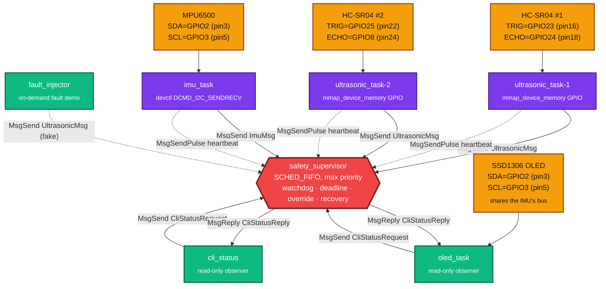
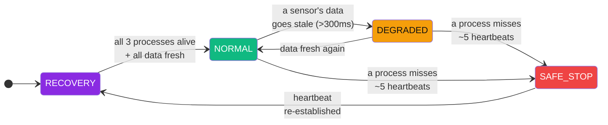

<div align="center">


<br/>


</div>

<br/>

## What this actually is

A **safety supervisor for autonomous vehicles**, built as five independent QNX processes instead of one program with five functions. That's not a style choice — it's the entire point. On a monolithic OS, "isolating the safety logic from the sensor drivers" is a discipline you hope your team maintains. On QNX, it's **structural**: `imu_task` can segfault on a bad I²C read and `supervisor` will never know, because they don't share an address space. This repo is built to prove that difference, not just claim it.

<div align="center">

| | | |
|:---:|:---:|:---:|
| 🟣 **5 processes** | 🟠 **2× ultrasonic + 1× IMU** | 🔴 **1 supervisor at max RT priority** |
| Own address space each | Fused into one override decision | Watchdog + deadline + recovery for all three |

</div>

---

## 🏗️ Architecture



Solid arrows are **synchronous `MsgSend`/`MsgReply`** (sensor data, CLI/OLED queries). Dashed arrows are **async `MsgSendPulse`** heartbeats — cheap, non-blocking, and never delayed by a slow sample cycle because each runs on its own thread — plus `fault_injector`'s deliberately-fake reading, sent the same way a real sensor would. Every arrow into `supervisor` terminates at the *same* channel; `name_attach()`/`name_open()` let every client find it by name, with zero hardcoded pids.

### Safety state machine



---

## ✅ Requirement → implementation

| Requirement | Where it lives | How |
|---|---|---|
| 🔀 **Message Passing** | all 5 processes | Native `MsgSend`/`MsgReceive`/`MsgReply` over a `name_attach()`-registered channel — no sockets, no queues |
| 💓 **Heartbeat** | every sensor task | Dedicated thread, `MsgSendPulse` every 50ms, independent of the sampling loop |
| 🐕 **Watchdog** | `supervisor.cpp::checkWatchdog` | ~5 missed heartbeats → process declared dead, logged, state transitions |
| ⏱️ **Safety Deadline** | `supervisor.cpp::checkDeadline` | Data older than 300ms is untrusted even if the process is alive — a *different* failure mode than a dead process |
| ⏲️ **Recovery Timer** | `supervisor.cpp::tryRecover` | 2s grace period, bounded to 3 logged attempts, then quiet in `SAFE_STOP` for a human |
| 🛡️ **Fault Tolerance** | driver + supervisor | `SensorStatus{Connected,Disconnected,OutOfRange}` classification, **plus** a plausibility check: a `Connected` reading outside the HC-SR04's physical 2–400cm range can't be a real echo, so it's logged as `AnomalyDetected` and forces override — not treated as an ordinary obstacle |
| 🚨 **Priority Override** | `supervisor.cpp::raisePriority` | Runs `SCHED_FIFO` at the system's max priority — always preempts sensor tasks, by the scheduler, not by convention |
| ⚡ **Override Latency** | `supervisor.cpp::updateOverride` | Measured end-to-end: sensor's `CLOCK_MONOTONIC` capture → supervisor's decision, in ms |
| 📋 **Safety Events** | 16-entry ring buffer | `Obstacle`, `SensorTimeout`, `ProcessDead/Recovered`, `OverrideEngaged/Cleared`, `AnomalyDetected` — every entry tagged with its source (`US1`/`US2`/`IMU`/`SYS`) and a snapshot of both ultrasonic distances at that instant |
| 💚 **Health Status** | per-subsystem + overall | `SensorHealth{Healthy,Degraded,Dead}` × 3 subsystems, rolled up into one `SystemState` |
| 🖥️ **CLI (mandatory)** | `cli_status` | `./cli_status` for one snapshot, `./cli_status --watch` to poll live — read-only, cannot influence the control path |
| 📺 **On-vehicle display** | `oled_task` | Same read-only `CliStatusRequest` query as `cli_status`, rendered to a physical SSD1306 panel: `VEHICLE MOVING` + live sensor data, or `VEHICLE STOPPED` + `OBSTACLE`/`ANOMALY DETECTED` the instant override engages |

### 🎯 The override rule, precisely

Two ultrasonic sensors means one nuance worth stating explicitly: **override engages the instant either sensor sees an obstacle, and only clears once both report clear.** A vehicle covering front and rear shouldn't ignore a rear hazard just because the front happens to be clear.

---

## 🔌 Hardware wiring

<div align="center">

| Sensor | Signal | GPIO | Physical pin |
|:---|:---:|:---:|:---:|
| **HC-SR04 #1** | TRIG (TX) | GPIO23 | 16 |
| | ECHO (RX) | GPIO24 | 18 |
| **HC-SR04 #2** | TRIG (TX) | GPIO25 | 22 |
| | ECHO (RX) | GPIO8 † | 24 |
| **MPU6500** | SDA | GPIO2 | 3 |
| | SCL | GPIO3 | 5 |
| | INT ‡ | GPIO17 | 11 |
| **SSD1306 OLED** | SDA | GPIO2 § | 3 |
| | SCL | GPIO3 § | 5 |
| | VCC | — | 1 (3.3V) |
| | GND | — | 6 |

</div>

† GPIO8 is SPI0 CE0 under its ALT function — fine as a plain GPIO as long as SPI0 isn't enabled elsewhere on the board.
‡ INT is wired but **not yet used** — see [Known limitations](#-known-limitations-read-this).
§ The OLED shares the MPU6500's I2C1 bus (same physical SDA/SCL wires, different address: 0x3C vs 0x68) rather than using its own GPIO0/1 bus. It was originally wired to GPIO0/1, but a full-address-range bus scan found nothing responding there — GPIO0/1 is the Pi's I2C0 (`ID_SD`/`ID_SC`) bus, reserved for HAT EEPROM detection, and unlike GPIO2/3 the board doesn't supply pull-up resistors on those pins, so SDA/SCL just floated. I2C being multi-drop makes sharing the working bus the simpler fix.

---

## 📁 Repo layout

```
hello/
├── common/
│   └── protocol.h          # shared IPC wire format — the only thing every process depends on
├── ultrasonic_task-1/      # HC-SR04 #1: gpio.{h,cpp}, ultrasonic.{h,cpp}, ultrasonic_task-1.cpp
├── ultrasonic_task-2/      # HC-SR04 #2: same driver, different pins + sensor id
├── imu_task/               # MPU6500 over /dev/i2c1: mpu6500.{h,cpp}, imu_task.cpp
├── supervisor/             # the safety state machine — supervisor.cpp
├── cli_status/             # read-only status client — cli_status.cpp
├── oled_task/              # read-only SSD1306 display client — ssd1306.{h,cpp}, font5x7.h, oled_task.cpp
└── fault_injector/         # optional demo tool — proves Fault Tolerance/Recovery live, see below
```

Each subfolder is its own QNX recursive-make project (own `Makefile`/`common.mk`/`nto/`), building independent `aarch64le` + `x86_64` executables — seven binaries total; the first six are the always-on system, `fault_injector` is a demo/test tool you run on demand.

---

## 🛠️ Build

```bash
# from inside each of the 5 project folders:
make
```

Produces `nto/aarch64/o-le/<name>` (Pi target) and `nto/x86_64/o/<name>` (host, for sanity-checking the build).

## 🚀 Deploy & run

```bash
# 1. copy all five binaries to the Pi
scp -o MACs=hmac-sha2-256 \
    ultrasonic_task-1/nto/aarch64/o-le/ultrasonic_task-1 \
    ultrasonic_task-2/nto/aarch64/o-le/ultrasonic_task-2 \
    imu_task/nto/aarch64/o-le/imu_task \
    supervisor/nto/aarch64/o-le/supervisor \
    cli_status/nto/aarch64/o-le/cli_status \
    oled_task/nto/aarch64/o-le/oled_task \
    fault_injector/nto/aarch64/o-le/fault_injector \
    qnxuser@<PI_IP>:/tmp/

# 2. on the Pi
cd /tmp && chmod +x ultrasonic_task-1 ultrasonic_task-2 imu_task supervisor cli_status oled_task fault_injector
```

Six terminals, **foreground**, in this order (GPIO access needs root; I²C doesn't):

| # | Command | Needs `sudo`? |
|:-:|---|:-:|
| A | `./supervisor` | no |
| B | `./imu_task` | no |
| C | `sudo ./ultrasonic_task-1` | **yes** |
| D | `sudo ./ultrasonic_task-2` | **yes** |
| E | `./cli_status --watch` | no |
| F | `./oled_task` | no |

### Sample output

```
=== Safety Supervisor Status ===
System State : DEGRADED
Override     : ACTIVE
Ultrasonic-1 : HEALTHY  | last=134.2cm, age=42ms
Ultrasonic-2 : HEALTHY  | last=87.6cm, age=38ms
IMU          : HEALTHY  | accel=(0.01,-0.02,0.03)g, age=21ms
Recent Safety Events (3):
  [t=104213ms] OBSTACLE           src=US1 value= 14.30 | US1=  14.3cm US2=  87.6cm
  [t=104213ms] OVERRIDE_ENGAGED   src=US1 value=  1.42 | US1=  14.3cm US2=  87.6cm
  [t=118990ms] ANOMALY_DETECTED   src=US2 value=5000.00 | US1= 134.2cm US2=5000.0cm
```

Every event line names **which subsystem** caused it (`src=US1/US2/IMU/SYS`) and shows **both** ultrasonic readings at that instant, not just the one that fired — so a judge reading the log can tell an obstacle in front from a fault at the rear without guessing. IMU accel settles near `(0,0,0)` at rest: `imu_task` calibrates out gravity/bias against ~50 stationary samples at startup, then applies a light exponential smoothing filter, so this number reflects real motion, not sensor tilt.

---

## 🧪 Fault injection demo (the 7th terminal)

The problem statement's exact wording is: *"The supervisor must override unsafe commands and place the vehicle in a safe state within a defined deadline."* Concretely, in this project that means two separate things `fault_injector` lets you trigger and watch on demand:

1. **Override an unsafe command** → `overrideActive` flips to `ACTIVE` the instant any sensor reports a hazard (an obstacle *or* a reading that can't physically be real), and a real navigation task would have its commands vetoed while this is true.
2. **Safe state within a deadline** → the state machine drops out of `NORMAL` the same tick the hazard is detected (well under the 50ms safety-tick period), not after some polling delay — that bound *is* the deadline.

`fault_injector` doesn't touch the real sensor — it runs **alongside** `ultrasonic_task-1`/`-2` and sends the supervisor a reading no real HC-SR04 echo could produce (e.g. 5000cm, outside the 2–400cm physical range) for whichever sensor you pick. The supervisor can't tell that apart from a genuinely stuck/corrupted sensor, which is the point: it's a fault, not a false obstacle, so it's logged as `ANOMALY_DETECTED`, not `OBSTACLE`.

```bash
# terminal G, while A-F above are already running:
./fault_injector 1          # inject a fake fault into ultrasonic-1 (or `2` for the other sensor)
```

Watch terminal E (`cli_status --watch`): `Ultrasonic-1` flips to `DEAD`, `System State` drops to `DEGRADED`, `Override` flips to `ACTIVE`, and an `ANOMALY_DETECTED` line appears in the event log — all within one safety tick.

**Recovery is automatic, not a reboot.** Press Ctrl+C on `fault_injector`; the real `ultrasonic_task-1` is still running underneath and its very next genuine reading clears the fault on its own — `Ultrasonic-1` goes back to `HEALTHY`, override clears once both sensors report clear, and `System State` returns to `NORMAL`. Nothing needs to be restarted or rebooted for this demo: the recovery path is the software noticing good data has resumed, which is both faster to show live and closer to how a real fault-tolerant system should behave (a transient bad reading shouldn't require a power cycle).

---

## ⚠️ Known limitations (read this)

Honesty over hackathon theater:

- **IMU sampling is polled (20Hz), not interrupt-driven.** The INT pin needs an exact GPIO→IRQ vector mapping specific to this BSP that wasn't available — polling is correct, just not the lowest-latency option.
- **Automatic process respawn was removed.** It briefly called `posix_spawn()` from `supervisor`'s max-priority `SCHED_FIFO` thread, which wedged the whole process (confirmed via `pidin -p` showing it blocked in `REPLY` state against `procnto`, unkillable even by `SIGKILL`). Recovery is now detected, timed, and logged — just not auto-executed. Restart the dead process manually when `[RECOVERY]` shows up.
- **GPIO access requires root** (`ThreadCtl(_NTO_TCTL_IO)`); I²C only requires group membership on `/dev/i2cN`. That's why the run table above has two different privilege levels.
- **The OLED shares the IMU's I2C bus, not its own.** It was originally wired to GPIO0/1 (I2C0, the `ID_SD`/`ID_SC` bus), which turned out to be a dead end: a full-address-range scan (`devctl(DCMD_I2C_SEND)` against every 7-bit address) found nothing responding at all, while the same scan against the MPU6500's bus immediately found it at 0x68. The Pi doesn't populate pull-up resistors on GPIO0/1 the way it does on GPIO2/3 — that bus is meant for a HAT to supply its own pull-ups for EEPROM detection — so with nothing else on it, SDA/SCL just floated. Moving the OLED onto GPIO2/3 (I2C1) fixed it: I2C is multi-drop, so the OLED (0x3C) and MPU6500 (0x68) coexist on the same two wires without conflict. `oled_task`'s device path is still a runtime argument (default `/dev/i2c1`), not hardcoded, in case the wiring changes again.
- **The OLED font is a hand-built 5x7 bitmap covering only space, `A`-`Z`, `0`-`9`, and `: . - ( )`** — enough for every string this project displays, not general text. An unsupported character renders as a blank cell rather than garbage, so a typo shows up as a gap, not corruption.

<div align="center">

<sub>Built for a QNX hackathon around one idea: a microkernel's safety story isn't "we wrote careful code," it's "the OS itself won't let one process's bug become another's."</sub>


</div>
